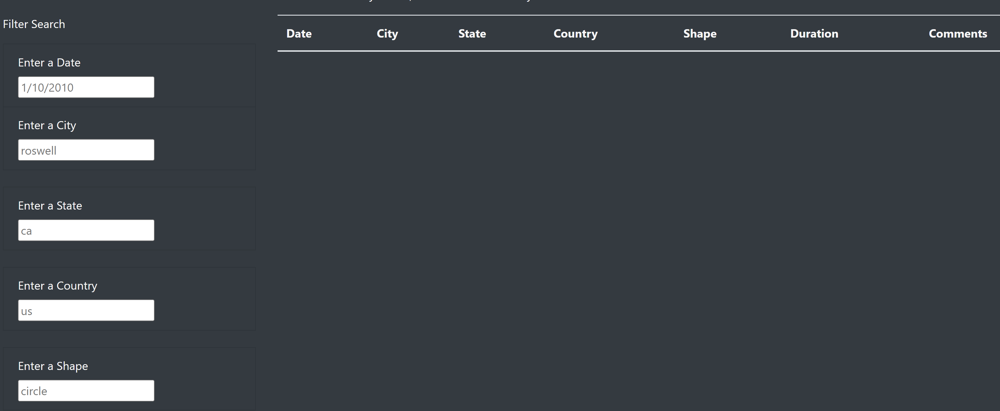

# UFO Sightings

# Overview of Analysis

Using Javascript to build a website,in order to provide a more in-depth analysis of UFO sightings by allowing users to filter for multiple criteria at the same time. While using CSS and Bootstrap to create a beautiful and responsive site as well.

# Results

1. Upon arriving at the UFOs site, you will see 'Filter Search' on the left hand side, with 5 search critera.  Date, city, state, country and shape. See the below picture.

2.  You may complete a search by entering the requested information in 1 or all 5 of the search criteria and pressing enter. Simple!

# Summary

The ease of use for the website is fairly simple, however, the biggest drawback is that the information returned is limited to the current data we have in out Javascript.   

As of now, this is only a search site, however, we could monetized it by adding blog posts and using affiliate links to products related to UFO's in anyway.  Also, to draw in more users, we could add a feature on the site, for users to add their own ufo experience information.  And is anyone does a search that pulls this information, it would list that the information was from a private user, and not verified, to protect the integrity of all information on the site.
